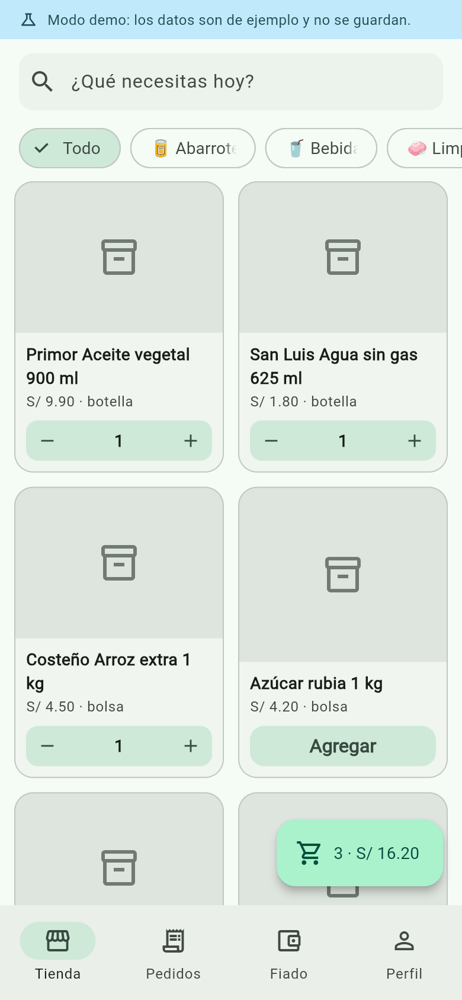
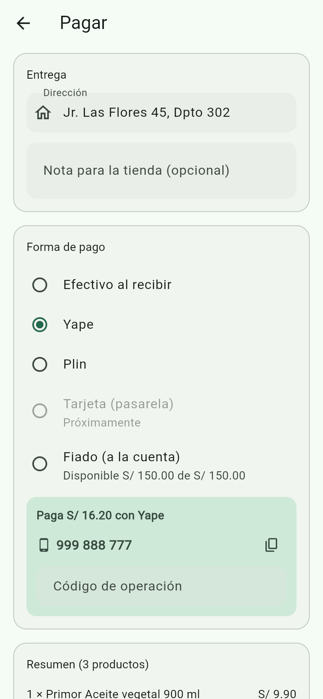
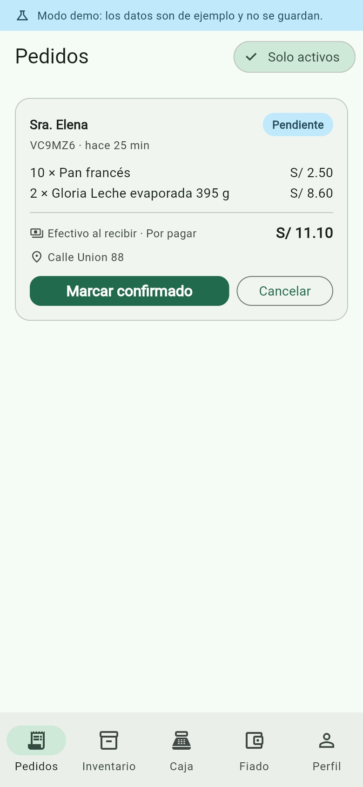
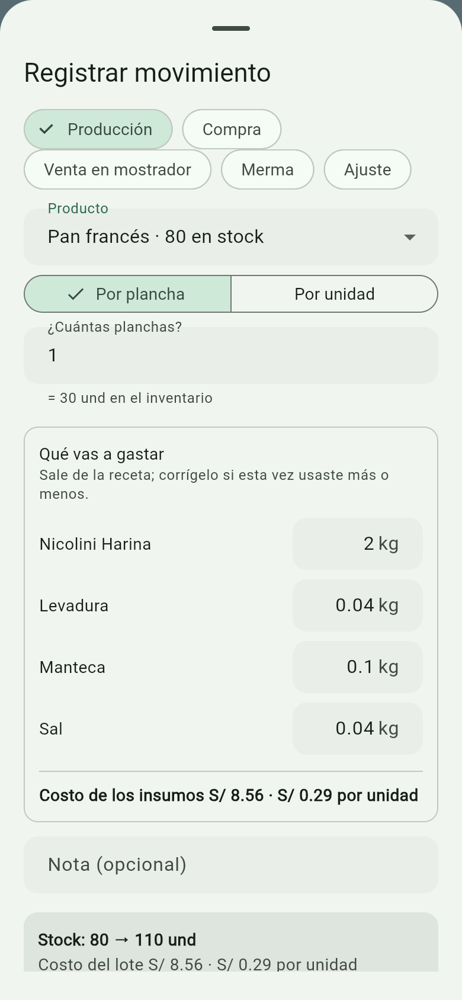

# Tienda de Barrio — app móvil

[English](README.md) · **Español**

App Flutter para una tienda de barrio: el vecino arma su pedido desde el celular
y el tendero lo atiende desde el mismo app. Incluye catálogo, carrito, pedidos,
panel del tendero, pagos y cuenta de fiado.

- **Flutter 3.44** (Android, iOS y web con el mismo código)
- **Supabase** para datos, sesión y pedidos en tiempo real
- **Riverpod** para el estado, **go_router** para la navegación

<p align="center">
  
  
  
  
</p>

<p align="center"><sub>Catálogo del cliente · pago con Yape · pedidos del tendero · producción con costo desde la receta (modo demo)</sub></p>

## Correr el proyecto

Sin credenciales arranca en **modo demo** con datos de ejemplo en memoria: sirve
para recorrer toda la app sin backend (nada se guarda al cerrar).

```bash
flutter run
```

En la pantalla de acceso del modo demo hay dos botones: *Cliente* y *Tendero*.

Con Supabase configurado:

```bash
flutter run --dart-define=SUPABASE_URL=https://xxxx.supabase.co --dart-define=SUPABASE_ANON_KEY=eyJhbGciOi...
```

Verificación rápida:

```bash
flutter analyze
```

```bash
flutter test
```

## Conectar Supabase

1. Crear un proyecto en [supabase.com](https://supabase.com) (el plan gratis alcanza de sobra).
2. Pegar y ejecutar `supabase/schema.sql` completo en el SQL Editor. Crea tablas,
   triggers, políticas RLS y las categorías iniciales.
3. Copiar *Project URL* y *anon/publishable key* desde Settings → API y pasarlas
   con `--dart-define` como arriba.
4. Registrarse en la app con el correo del dueño y ascenderlo a tendero:

```sql
update public.perfiles set rol = 'tendero'
 where id = (select id from auth.users where email = 'dueno@tienda.com');
```

El rol nunca se elige desde la app: nace siempre como `cliente` y se asciende a
mano en la base. Así nadie se hace tendero registrándose.

## Cómo está armado

```
lib/
  core/        config (dart-define), tema, formatos, router
  datos/
    modelos/   Producto, Pedido, CuentaFiado, ...
    repos/     interfaces + implementación Supabase + implementación en memoria
  estado/      providers de Riverpod, carrito y checkout
  ui/
    auth/      acceso y registro
    cliente/   catálogo, carrito, pago, mis pedidos, mi fiado
    tendero/   pedidos, inventario, insumos, recetas, escáner, caja, fiado
    comun/     perfil y widgets compartidos
supabase/schema.sql
tool/icono.py
```

La app solo conoce las **interfaces** de `datos/repos/repos.dart`. Detrás puede
estar Supabase o el almacén en memoria; se decide en un único lugar
(`estado/providers.dart`). Por eso el modo demo no ensucia las pantallas.

## Pagos

`PasarelaPago` (`datos/repos/pasarela.dart`) es el único punto por donde pasa un
cobro. Hoy hay una implementación, `PagoLocal`:

| Método | Qué pasa |
|---|---|
| Efectivo | El pedido queda *por pagar*; se cobra al entregar |
| Yape / Plin | El cliente ve el QR de la tienda y su número —con un botón para copiarlo—, paga y escribe el código de operación → el pedido queda *verificando* → el tendero confirma o rechaza desde su panel |
| Fiado | Se valida el cupo, se carga a la cuenta del cliente y el pedido queda *al fiado* |
| Tarjeta | Deshabilitado: requiere pasarela |

### El QR de la tienda

El tendero sube su propio QR en **Perfil → Cómo me pagan**: elige la imagen que
exportó de Yape o Plin y queda guardada en Supabase Storage (bucket `tienda`,
público de lectura, escritura solo para el tendero). Cada método tiene su
número y su QR por separado, y subir uno nuevo reemplaza al anterior en vez de
ir dejando archivos sueltos.

Un método solo se le ofrece al cliente si tiene número o QR; si no, aparece
deshabilitado con "La tienda aún no lo tiene configurado". En modo demo el QR
se guarda como data URI en memoria, sin Storage detrás.

Junto al número hay un **botón de copiar**. El vecino va a salir de la app para
pagar, y teclear nueve dígitos de memoria en la otra pantalla es donde más se
equivoca: un dígito mal puesto manda la plata a un desconocido.

Para conectar una pasarela real (Mercado Pago, Culqi, Izipay) se implementa esa
misma interfaz y se cambia una línea en `estado/providers.dart`; ninguna pantalla
necesita cambiar. Ojo: una pasarela exige cuenta de comercio y verificación de
identidad del negocio, ese trámite va aparte del código.

## Entrar con Google

> **Hoy el botón no se ve.** El camino está escrito y probado, pero la app
> todavía no está registrada en Google Cloud, así que se esconde: más vale una
> pantalla con una sola forma de entrar que un botón que falla al tocarlo.
> Se enciende pasando el ID de cliente por `--dart-define`, sin tocar código.
>
> La dependencia nativa (`google_sign_in`) **se quitó mientras tanto**, porque
> subía el mínimo de Android a la versión 6 y dejaba fuera celulares viejos por
> una función apagada. Encendido así, Google se abre en el navegador y vuelve a
> la app. Para recuperar el selector de cuentas del sistema —que es mejor— hay
> que volver a instalarla: `flutter pub add google_sign_in`.

Cuando esté encendido, la pantalla de acceso ofrece **Continuar con Google** y
nada más. El formulario de correo pasa detrás de *Prefiero usar mi correo*, para
los celulares sin servicios de Google y para el que prefiera una contraseña.

El nombre y el correo salen de la cuenta del celular; el vecino no escribe nada.
Lo que Google no tiene —celular y dirección— se pide en el primer pedido y queda
guardado en el perfil, así el segundo sale lleno. Eso último ya está activo:
vale igual para quien se registra con correo.

### Registrarlo en Google Cloud

Estos son los pasos que faltan para encenderlo.

1. En [console.cloud.google.com](https://console.cloud.google.com) crear un
   proyecto y configurar la **pantalla de consentimiento OAuth**.
2. *Credenciales → Crear credenciales → ID de cliente de OAuth*, tipo
   **Aplicación web**. En URIs de redireccionamiento autorizados va
   `https://TUPROYECTO.supabase.co/auth/v1/callback`. Guardar el **ID de cliente
   y el secreto**: este es el que la app necesita.
3. Otra credencial, esta vez tipo **Android**, con el nombre del paquete
   (`com.jorge.tienda_barrio`) y la huella SHA-1 del certificado. Para sacarla:

```bash
keytool -list -v -keystore %USERPROFILE%\.android\debug.keystore -alias androiddebugkey -storepass android -keypass android
```

   Esa es la huella de **depuración**. El día que se genere la llave de firma
   para Play Store hay que registrar también su SHA-1, o el botón dejará de
   funcionar justo en la versión publicada.

4. En Supabase: *Authentication → Providers → Google*, activarlo y pegar el ID
   de cliente y el secreto del paso 2 (los de **web**, no los de Android).

Luego se corre con las dos credenciales de Supabase más el ID de cliente web:

```bash
flutter run --dart-define=SUPABASE_URL=https://xxxx.supabase.co --dart-define=SUPABASE_ANON_KEY=eyJhbGciOi... --dart-define=GOOGLE_SERVER_CLIENT_ID=1234-abcd.apps.googleusercontent.com
```

Android pide el ID de cliente **web**, no el suyo. El de Android sirve para que
Google reconozca al APK por su huella; la audiencia del token es quien lo va a
leer, que es Supabase. Es el error que más tiempo cuesta, porque falla sin decir
por qué (ADR-0005).

El botón aparece en cuanto hay ID de cliente, también en modo demo. Ahí está
simulado: entra como el vecino de ejemplo sin pedirle cuenta a nadie, que es lo
único que se puede hacer sin backend.

## Ficha del producto

Cada producto guarda **nombre, marca, tipo (categoría), precio, cantidad en
stock, presentación** (botella, bolsa, lata) y **peso o volumen** (900 ml, 1 kg),
además del código de barras.

Marca y contenido son campos aparte, no parte del nombre: así el catálogo puede
mostrar "Primor Aceite vegetal 900 ml" armado solo, el cliente puede buscar por
marca, y cambiar el envase de 900 ml a 1 L no obliga a reescribir el nombre. Lo
que se vende a granel deja el peso vacío y no arrastra nada.

## Código de barras

El alta de mercadería empieza en el escáner: en **Inventario → Escanear** el
tendero apunta al envase y la app decide sola.

- Si el código ya está registrado, abre ese producto para reponer stock o
  corregir el precio — nunca crea un duplicado.
- Si es nuevo, abre el alta con el código puesto: solo falta nombre, precio y
  cantidad.
- El código también se puede escribir a mano (etiquetas rotas o despegadas) y
  el campo acepta lo que teclea una pistola lectora USB.
- Lo que se vende suelto (pan, verduras) se queda sin código: la columna guarda
  NULL y el índice único de la base tolera varios así.

Un código pertenece a un solo producto; si se repite, la app avisa de quién es
en vez de guardar dos filas que el escáner no podría distinguir.

Lee EAN-13, EAN-8, UPC-A, UPC-E y Code 128 con `mobile_scanner`. El permiso de
cámara ya está declarado en `AndroidManifest.xml` e `Info.plist`.

## Ingresos y egresos

Todo lo que entra o sale del inventario deja una fila en el **kardex**
(`movimientos_inventario`): producción, compra, venta, merma, ajuste y
devolución. El stock del producto es el saldo de esos movimientos y la caja del
día es su suma en soles — no hay dos verdades que puedan desfasarse.

| Movimiento | Stock | Caja |
|---|---|---|
| Producción | sube | sale el costo |
| Compra | sube | sale el costo |
| Venta (pedido o mostrador) | baja | entra el cobro |
| Merma | baja | se pierde el costo |
| Ajuste | corrige | no mueve plata |
| Devolución (pedido cancelado) | vuelve | se descuenta el ingreso |

La pestaña **Caja** del tendero muestra, por día / 7 días / mes: cuánto entró,
cuánto salió, cuánto le queda, el margen y qué se vendió. Las ventas por pedido
entran solas; producción, compras, mermas y ventas de mostrador las registra el
tendero con el botón *Registrar*.

Las ventas de pedidos las escribe un trigger en la base, no la app: así el
kardex no depende de que el celular termine bien la operación.

## El caso de la panadería

Un producto puede declarar **cuántas unidades salen de un lote** y **de a
cuántas se vende**:

- Pan francés: `unidades_por_lote = 30`, `nombre_lote = "plancha"`,
  `unidades_por_paquete = 4`, precio S/ 0.25, costo S/ 0.12.
- Al registrar producción el tendero escribe **2 planchas** y la app inventaría
  **60 panes**, con un costo de S/ 7.20.
- El catálogo muestra "S/ 0.25 · und" y debajo "4 x S/ 1.00".
- Vendida la plancha entera: entran S/ 7.50, salieron S/ 3.60, quedan S/ 3.90
  (52% de margen).

El precio guardado siempre es el **unitario**; el paquete es solo cómo lo pide
el cliente. Así 10 panes cuestan S/ 2.50 sin tener que armar combos, y cambiar
"4 por un sol" a "5 por un sol" no obliga a tocar el precio de cada venta.

El stock de un producto ya creado **no se edita a mano**: se mueve con
Producción, Compra, Merma o Ajuste. Es la única forma de que el inventario y la
caja cuenten la misma historia.

## Insumos y producción

La harina no se vende: se **consume**. Por eso vive en su propio almacén
(**Inventario → Insumos**), con su propio kardex.

- Se **compra en presentación** y se **gasta en la unidad base**: entran "2
  sacos" y la app inventaría 100 kg. Al producir se descuenta por kilo.
- El costo del kilo es **promedio ponderado**: si quedaban 20 kg a S/ 3.60 y
  entran 50 kg a S/ 4.00, el kilo pasa a S/ 3.89. Sin esto el margen saltaría
  cada vez que cambia el precio del saco.
- Cada producto puede tener una **receta**: "una plancha lleva 2 kg de harina".
  Al registrar la producción la app propone el consumo según los lotes y el
  tendero lo corrige — la masa nunca sale idéntica.
- El **costo del pan sale de ahí**: los insumos gastados ÷ unidades que
  salieron. Ese número queda en el producto, así el margen es real y se entera
  el mismo día en que sube la harina.
- Compara **lo que salió con lo que debía salir**: 2 planchas de 100 deberían
  dar 200 panes; si salieron 180, lo dice y el costo por pan sube solo.
- No deja producir si no alcanza el insumo, y no descuenta nada a medias: la
  horneada entera es una sola operación.

### La caja cuenta plata, no valor

Con insumos aparece el riesgo de contar dos veces: si el saco es egreso al
comprarlo y la horneada vuelve a serlo, la caja mentiría. La regla es:

- **Sale plata** al comprar (insumos o mercadería hecha).
- **Entra plata** al vender.
- **Producir no mueve caja**: transforma harina ya pagada en pan. Su costo
  sirve para valorizar el producto y calcular el margen.
- **La merma tampoco mueve caja**, pero se muestra aparte valorizada: no es
  plata que sale, es plata que ya no vuelve.

## Fiado

Cada cliente tiene un cupo (`limite_fiado`, S/ 100 por defecto). El saldo no se
guarda: se calcula sumando los movimientos (`cargo` suma deuda, `abono` la resta),
así el historial siempre cuadra con el número que se muestra.

- El cliente ve su deuda, su cupo disponible y sus movimientos.
- El tendero registra abonos y consumos, y cambia el cupo de cada cliente.
- Si el pedido no entra en el cupo disponible, el método *fiado* se deshabilita.

## Nombre e ícono

La app se llama **Tienda de Barrio** en el cajón de aplicaciones, y arranca sobre
un fondo verde en vez del blanco por defecto.

El ícono no es un PNG que alguien dibujó una vez: se dibuja en `tool/icono.py` y
de ahí salen los tamaños de Android, iOS y web.

```bash
python tool/icono.py
```

Cambiar el color o la forma es editar ese archivo y volver a correrlo; los PNG
generados se quedan en el proyecto, así que compilar no necesita Python. Android
recibe además el **ícono adaptativo** (el launcher lo recorta en círculo o en
cuadrado según el fabricante) y la capa monocroma que usan los íconos temáticos
de Android 13.

## Decisiones

Las decisiones que costaría revertir están en `docs/decisions/`:

| ADR | Decisión |
|---|---|
| [0001](docs/decisions/0001-kardex-como-unica-verdad-del-stock.md) | El kardex es la única verdad del stock |
| [0002](docs/decisions/0002-la-caja-cuenta-plata-no-valor.md) | La caja cuenta plata, no valor |
| [0003](docs/decisions/0003-el-pedido-que-llega-del-celular-no-es-confiable.md) | El pedido que llega del celular no es confiable |
| [0004](docs/decisions/0004-costo-promedio-ponderado-de-insumos.md) | El costo del insumo es promedio ponderado |
| [0005](docs/decisions/0005-entrar-con-google-y-el-correo-de-respaldo.md) | Entrar con Google, y el correo de respaldo |

## Pendientes conocidos

- **Notificaciones push** cuando entra un pedido nuevo (hoy el panel se actualiza
  en vivo solo con la app abierta).
- **Fotos de productos**: el editor acepta una URL; falta subir la foto desde el
  celular con Supabase Storage.
- **Escanear para cobrar**: la venta de mostrador se registra eligiendo el
  producto de una lista; falta poder pasarlo por el escáner.
- **Caja del día por método de pago**: el resumen suma todo junto; no separa
  cuánto fue efectivo, cuánto Yape y cuánto quedó al fiado.
- **Historial de rendimiento**: la app compara cada horneada con lo esperado,
  pero no grafica cómo evoluciona ni avisa si el rendimiento viene cayendo.
- **Mano de obra y gas** no entran al costo: solo los insumos. El margen real
  de la panadería es algo menor que el que muestra la app.
- **Precio cambiado a mitad del pedido**: la base manda sobre el precio (ADR-0003),
  así que si sube entre que el cliente arma el carrito y confirma, el total puede
  diferir de lo que vio. Falta avisárselo en pantalla.
- **Firma para Google Play**: el APK se firma hoy con la llave de depuración
  (`android/app/build.gradle.kts`). Instala en un celular, pero para publicar
  hace falta generar una llave propia y un `key.properties` fuera del proyecto.
